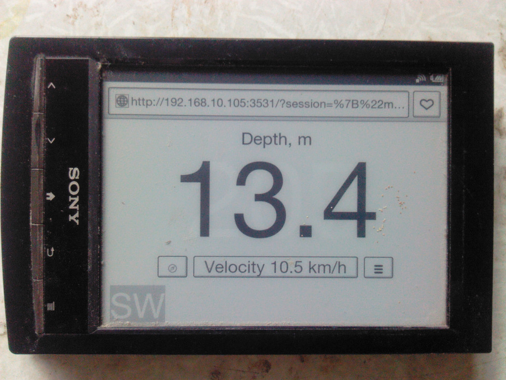
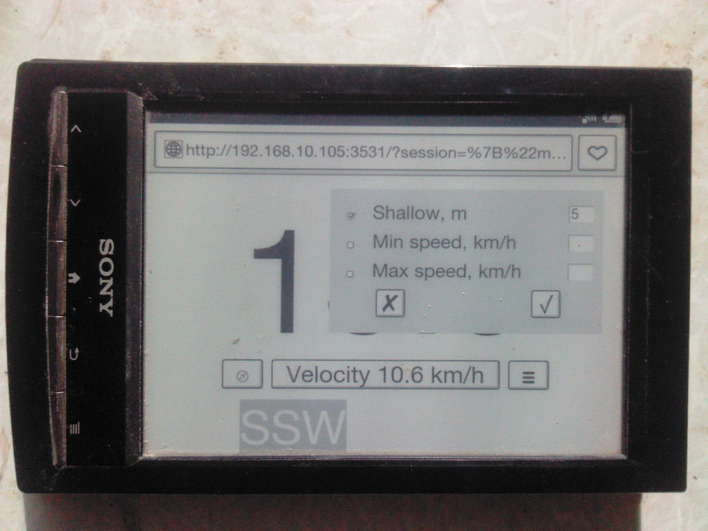

# e-ink Dashboard for Signal K 

## v. 0.3
The e-inkDashboard displaying some instruments, attached to Signal K on weak (and/or old) devices, such as e-ink readers.  
Only browser needed. No fanciful javascript, no fanciful css.  

## Features

* velocity
* depth
* true or magnetic course
* alarms

  
  
At the border of the screen is always visible the mark with general direction.

## Compatibility
Linux. Signal K.

## Usage
The screen image optimized to different screen resolutions and should look good from little to big screens.  
The presence of the touch screen is assumed, and mode is switched by a tap to the next data type button on the screen.   You can use two or more devices to display different info.  
For some devices with JavaScript you may set up some hardware keys to switch mode, magnetic or true course and opening alarm menu. Use  button on bottom of alarm menu to set up it. Default keys is:

* ArrowDown for next mode
* ArrowUp for previous mode
* AltRight for alarm menu
* KeyM for magnetic course switch
 
Access to the e-inkDashboard by address:   

`http://YourSignalKhost:YourSignalKport/e-inkdashboard/`  

 The e-inkDashboard allows you to set a visual and sound signal for dangerous events, such as shallow or speed.
  
Set up your browser to allow sound signal.  
The signal settings are local for every showing device, and it is triggered only if the device work. Be careful!

## Install&configure:
Install plugin from Signal K Appstore as **e-inkdashboard**.  
Restart Signal K,  
Use Server -> Plugin Config menu to start plugin and configure port and update frequency.  
Set update frequency to comfort rate for your device. Note that too quick update make difficult a mode change, but to slow update is dangerous of not noticing a rapidly changing parameter such as depth.  
Press Submit to save changes.

## SignalK alarms
Since the SignalK does not any alarm handling, e-inkDashboard has its own. But the e-inkDashboard sets the SugnalK's alarm states for velocity, depth and course and raises the SugnalK's alarms notifications.  
Besides that the e-inkDashboard take MOB notification from SignalK. If it has spatial info ([GaladrielMap SignalK edition](https://github.com/VladimirKalachikhin/GaladrielMapSK) send it) - then displays direction to MOB.

## Thanks

* [Typicons by Stephen Hutchings](https://icon-icons.com/pack/Typicons/1144) for icons.
* [ryanflorence](https://gist.github.com/ryanflorence/701407) for ideas.

## Support

[Discussions](https://github.com/VladimirKalachikhin/Galadriel-map/discussions)

The forum will be more lively if you make a donation [via PayPal](https://paypal.me/VladimirKalachikhin)  at [galadrielmap@gmail.com](mailto:galadrielmap@gmail.com) or at [ЮMoney](https://yasobe.ru/na/galadrielmap)

[Paid personal consulting](https://kwork.ru/it-support/20093939/galadrielmap-installation-configuration-and-usage-consulting)  
