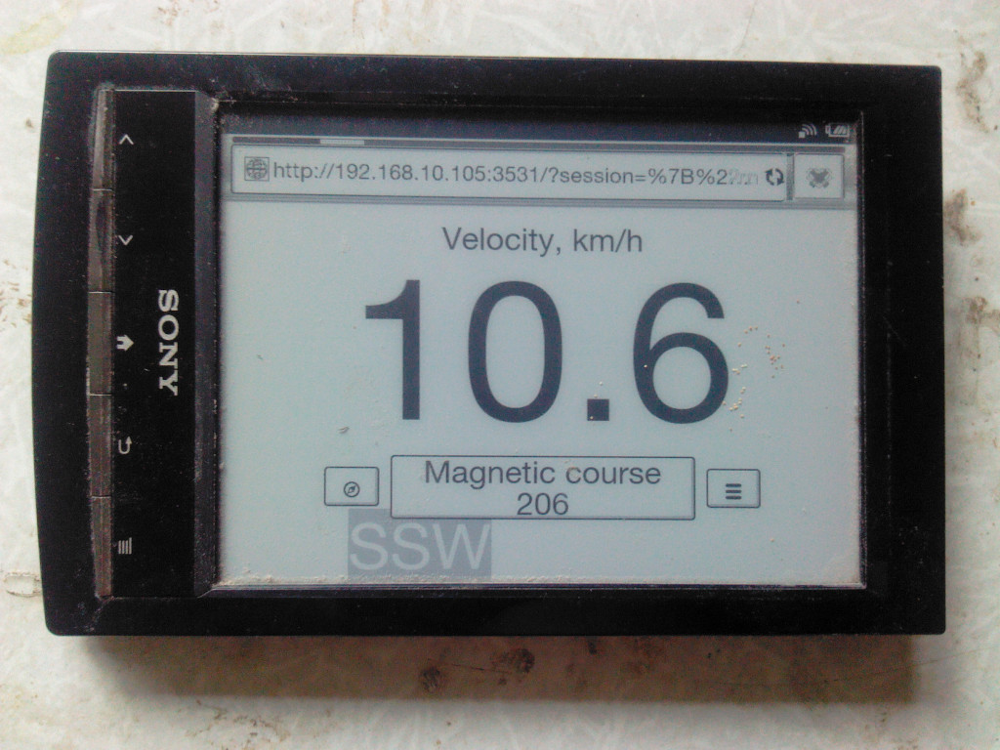
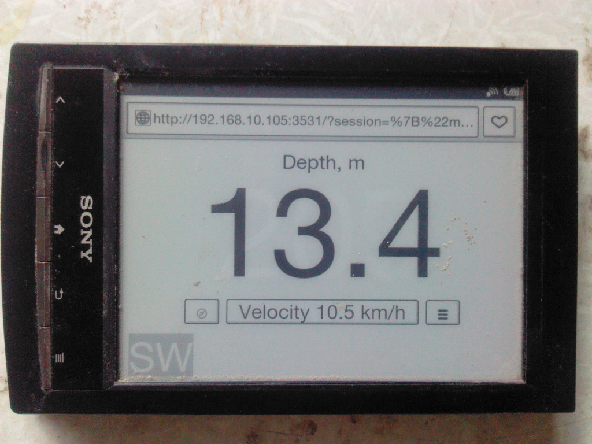
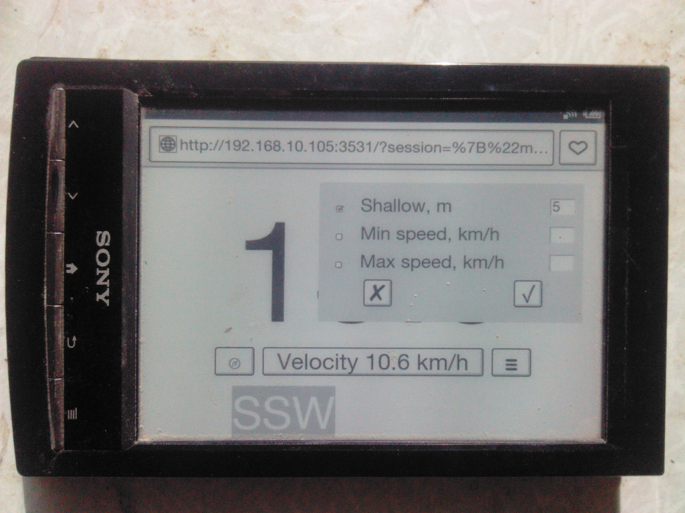

# e-ink Dashboard for Signal K 

e-inkDashboard -- это расширение для Signal K, веб-приложение, которое показывает некоторые параметры от сервера Signal K на слабых (и/или старых) устройствах, таких как читалки электронных книг с экраном на электронных чернилах или старые планшеты.  
На устройство не нужно устанавливать никаких приложений. Нужен только браузер.

## v. 0.0

## Возможности
Показ:

* Скорости
* Глубины
* Истинного или магнитного курса (путевого угла, если быть точным)
* Сигнализация о выходе некоторых параметров за установленные пределы
* Русский и английский интерфейс

  
  

## Требования
Операционная система семейства Linux, Signal K

## Использование
Веб-приложение оптимизировано для экранов весьма различного разрешения -- от самых маленьких до больших. Никакой настройки не требуется.  
Предполагается, что клиентское устройство оснащено чувствительным к нажатию экраном, и управление приложением происходит нажатиями на экран.  
Выбор основного отображаемого параметра осуществляется средней кнопкой в нижней части экрана, кроме того, генеральное направление движения всегда отображается серой маркой у края экрана.  
При наличии поддержки javascript на некоторых клиентских устройствах можно настроить некоторые аппаратные клавиши для переключения режимов, вызова меню оповещений и переключения между истинным и магнитным курсом. Настройка аппаратных клавиш находится внизу окна оповещений. Нажмите .   
По-умолчанию используются:

* Стрелка вниз для следующего режима
* Стрелка вверх для предыдущего режима
* Правая клавиша Alt для вызова меню оповещений
* Клавиша M (латинская M) для переключения между истинным и магнитным курсом
 
Может быть запущено несколько экземпляров веб-приложения, отображающих разную информацию -- в разных окнах или на разных устройствах.  
Доступ к веб-приложению осуществляется по адресу

`http://YourSignalKhost:YourSignalKport/e-inkdashboard/`  

где YourSignalKhost -- адрес компьютера, на котором работает Signa K;  
YourSignalKport -- порт на этом компьютере, на котором отвечает Signal K

Веб-приложение позволяет назначить визуальную и звуковую сигнализацию на выход некоторых параметров за установленные значения:
  
Для звукового сигнала может потребоваться дополнительная настройка браузера.  
Сигнализация устанавливается отдельно на каждом показывающем e-inkDashboard устройстве, и сработает только в том случае, если устройство активно и показывает e-inkDashboard. Будьте внимательны!

## Установка и конфигурирование

Установите расширение из  Signal K Appstore как **e-inkdashboard** обычным образом.  
Перезапустите Signal K  
В меню Server -> Plugin Config сервера Signal K укажите запуск расширения при старте сервера, порт, на котором будет работать веб-приложение и желаемую частоту обновления экрана веб-приложения.  
Не забывайте нажать Submit для сохранения изменений.  
Частоту обновления экрана следует установить настолько быстрой, насколько позволяет используемое устройство, с тем, чтобы важные изменения параметров (например, глубины) не были пропущены. Вместе с тем, слишком быстрое обновление экрана затруднит манипуляции с интерфейсом.

## Благодарности

* [Typicons by Stephen Hutchings](https://icon-icons.com/pack/Typicons/1144) за графические элементы интерфейса.
* [ryanflorence](https://gist.github.com/ryanflorence/701407) за идеи.

## Поддержка

[Обсуждение](https://github.com/VladimirKalachikhin/e-inkDashboard/discussions)

Консультации могут быть получены в обмен на чашку кофе [через PayPal](https://paypal.me/VladimirKalachikhin) или [YandexMoney](https://yasobe.ru/na/galadrielmap) по адресу [galadrielmap@gmail.com](mailto:galadrielmap@gmail.com)  

